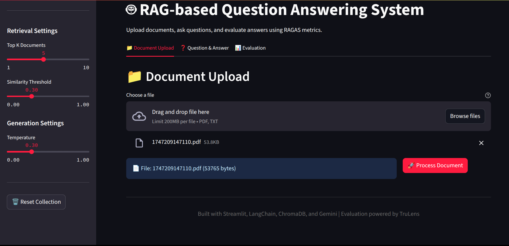
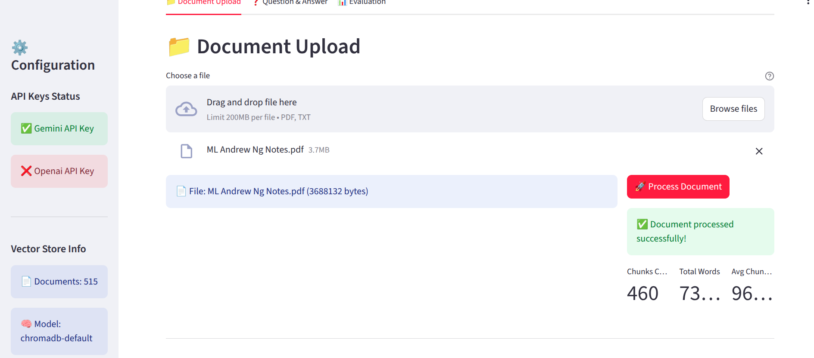
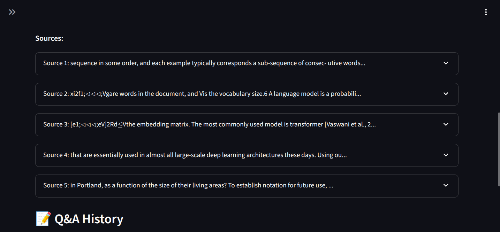
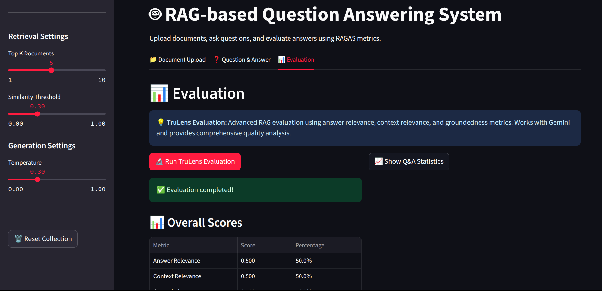

# 🤖 Intelligent Document Q&A System

A production-ready Retrieval-Augmented Generation (RAG) system for intelligent document question-answering with comprehensive evaluation capabilities.

## 🏗️ Architecture

- **Frontend**: Streamlit web interface with real-time configuration
- **Backend**: Modular Python architecture with comprehensive error handling
- **Vector Database**: ChromaDB for persistent document embeddings
- **LLM**: Google Gemini 2.5 Flash for answer generation
- **Evaluation**: TruLens framework for RAG quality assessment

## 🚀 Features


*Main application interface with document upload, Q&A, and evaluation tabs*

### Core Capabilities
- **Multi-format Document Processing**: PDF, TXT with intelligent chunking
- **Advanced Retrieval**: Semantic search with contextual compression
- **AI-Powered Q&A**: Context-aware answer generation with source attribution
- **Quality Evaluation**: Comprehensive metrics for answer relevance and groundedness
- **Interactive Interface**: Real-time parameter adjustment and conversation history

### Technical Highlights
- **Production-Ready**: Environment-based configuration and comprehensive logging
- **Scalable Architecture**: Modular design supporting multiple LLM and embedding providers
- **Persistent Storage**: ChromaDB with automatic document versioning
- **Performance Monitoring**: Real-time evaluation metrics and statistics
- **Source Attribution**: Document-level source tracking and citation


*Document processing workflow showing chunking and vector storage*


*Source attribution and document tracking in Q&A responses*

## 📊 System Capabilities

- **Processing**: Efficient document chunking and vector storage with ChromaDB
- **Retrieval**: Fast semantic search with configurable similarity thresholds
- **Scalability**: Modular architecture designed for high-volume document processing
- **Evaluation**: Comprehensive quality assessment using TruLens framework
- **Reliability**: Production-ready error handling and session management

## 🛠️ Technology Stack

| Component | Technology | Purpose |
|-----------|------------|---------|
| **Frontend** | Streamlit | Interactive web interface |
| **LLM** | Google Gemini 2.5 Flash | Answer generation |
| **Vector DB** | ChromaDB | Document embeddings storage |
| **Processing** | LangChain, PyPDF2 | Document processing pipeline |
| **Evaluation** | TruLens | RAG quality assessment |
| **Configuration** | Environment Variables | Secure settings management |

## 🚀 Quick Start

1. **Install Dependencies**:
   ```bash
   pip install -r requirements.txt
   ```

2. **Set API Keys**:
   ```bash
   export GEMINI_API_KEY="your_gemini_api_key"
   ```

3. **Run Application**:
   ```bash
   streamlit run app.py --server.port 5000
   ```

4. **Access Interface**: http://localhost:5000

## 📸 Demo Screenshots

### Main Application Interface


### Document Processing Workflow


### Source Attribution & Q&A


### TruLens Evaluation Dashboard


## 📁 Project Structure

```
IntelligentDocumentQA/
├── app.py                     # Main Streamlit application
├── utils/                     # Core utilities
│   ├── config.py             # Configuration management
│   ├── document_processor.py # Document loading and chunking
│   ├── vector_store.py       # Vector database operations
│   ├── retriever.py          # Advanced retrieval logic
│   ├── qa_chain.py           # Question answering with LLM
│   └── evaluation.py         # RAG evaluation framework
├── .streamlit/config.toml    # Streamlit configuration
└── chroma_db/                # Persistent vector database
```

## 🎯 Use Cases

- **Enterprise Knowledge Management**: Internal document Q&A systems
- **Customer Support**: Automated FAQ and documentation assistance
- **Research & Analysis**: Academic paper and report analysis
- **Legal Document Review**: Contract and compliance document processing
- **Educational Tools**: Textbook and course material Q&A systems

## 🔮 Roadmap

- [ ] Multi-LLM support (OpenAI, Claude, local models)
- [ ] REST API endpoints
- [ ] Advanced caching and performance optimization
- [ ] Multi-language support
- [ ] Enterprise authentication integration

## 📈 Performance & Evaluation


*TruLens evaluation dashboard showing comprehensive RAG quality metrics*

The system includes comprehensive evaluation using TruLens framework:
- **Answer Relevance**: Measures how well answers address questions
- **Context Relevance**: Evaluates retrieval quality and relevance
- **Groundedness**: Assesses answer factual accuracy against sources
- **Real-time Metrics**: Live performance monitoring and statistics

---

*Built with ❤️ using modern AI/ML best practices and production-ready architecture.*
